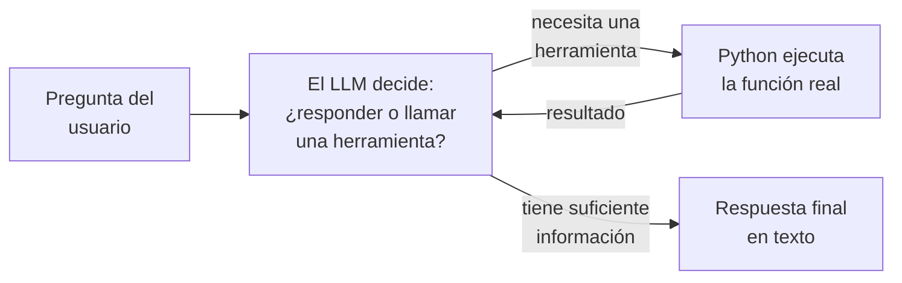

# Cómo funciona este agente con tool-use

Este documento recorre [`agent.py`](../agent.py), [`tools.py`](../tools.py) y
[`app.py`](../app.py) paso a paso, en el orden en que realmente se ejecutan. No
asume conocimiento previo de "agentes de IA" — solo del chatbot RAG anterior
(ayuda, pero no es obligatorio).

## El panorama general

Un LLM normal solo puede generar texto — no puede sumar con precisión, no sabe el
clima de hoy, ni la hora actual. **Tool-use** (o *function calling*) le da al modelo
la posibilidad de pedir ayuda: en vez de responder directo, puede decir "necesito
llamar a la función `calculator` con el argumento `expression='23*4'`", el código
Python ejecuta esa función de verdad, y le devuelve el resultado al modelo para que
termine su respuesta con esa información real en la mano.

Esto es exactamente el mecanismo detrás de cualquier "agente de IA" del que se habla
hoy — desde un asistente que agenda reuniones hasta uno que navega la web. Este
proyecto lo implementa de la forma más simple posible: sin frameworks (LangChain,
etc.), hablando directo con la API de Groq, para que el protocolo se vea completo.



Ese ciclo (el modelo decide → una herramienta corre → el modelo vuelve a decidir)
puede repetirse varias veces antes de llegar a una respuesta — por ejemplo, si el
usuario pregunta por el clima en dos ciudades distintas.

---

## Las herramientas ([`tools.py`](../tools.py))

Cada herramienta tiene dos partes que **siempre van juntas**: la función Python que
hace el trabajo real, y un *schema* (JSON) que le describe al LLM qué hace la
herramienta y qué argumentos espera — el modelo nunca ve el código Python, solo lee
ese schema para decidir si y cómo llamarla.

### 1. Calculadora ([`_eval_node`](../tools.py), línea 30)

```python
def _eval_node(node):
    if isinstance(node, ast.Constant) ...
    if isinstance(node, ast.BinOp) and type(node.op) in _SAFE_OPERATORS: ...
```

**Por qué no es un simple `eval(expression)`**: el LLM es quien construye el string
de la expresión a partir de lo que el usuario escribió — si ese string llegara a
`eval()` directamente, un usuario podría manipular la conversación para que el
modelo "calcule" algo como `__import__('os').system('...')`, y `eval()` lo
ejecutaría de verdad. En vez de eso, `_eval_node` recorre el árbol sintáctico
(`ast.parse`) y solo permite números y operadores aritméticos (`+ - * / % **`) —
cualquier otra cosa (llamadas a función, imports, atributos) lanza un error en vez
de ejecutarse. Es un ejemplo real de por qué "el LLM generó este código" no es lo
mismo que "es seguro ejecutarlo".

### 2. Clima ([`get_weather`](../tools.py), línea 56)

Dos llamadas a la API gratuita de [Open-Meteo](https://open-meteo.com) (sin API
key): primero *geocoding* (nombre de ciudad → latitud/longitud), luego *forecast*
(coordenadas → clima actual). Ninguna requiere autenticación — a diferencia del
chatbot RAG (que sí necesita `GROQ_API_KEY`), esta herramienta es 100% gratis y sin
registro.

### 3. Búsqueda en Wikipedia ([`search_wikipedia`](../tools.py), línea 86)

Esta pasó por dos rondas de arreglos reales durante el desarrollo (ver la sección de
troubleshooting) — vale la pena leerla para entender por qué terminó con dos
llamadas HTTP en vez de una.

### 4. Hora actual ([`get_current_time`](../tools.py), línea 115)

La única herramienta que no llama a ninguna API externa — usa `zoneinfo` (librería
estándar de Python) para convertir la hora actual a cualquier zona horaria IANA
(`America/Santiago`, `UTC`, etc.).

### Los schemas ([`TOOL_SCHEMAS`](../tools.py), línea 125)

```python
{
    "type": "function",
    "function": {
        "name": "calculator",
        "description": "Evaluate a basic arithmetic expression...",
        "parameters": {
            "type": "object",
            "properties": {"expression": {"type": "string", "description": "..."}},
            "required": ["expression"],
        },
    },
}
```

Este formato (JSON Schema) es un estándar que adoptaron OpenAI, Groq, Anthropic y
la mayoría de proveedores de LLM — el modelo fue entrenado específicamente para leer
esta estructura y generar argumentos que calcen con ella. La `description` de cada
parámetro importa tanto como su tipo: es literalmente la única documentación que el
modelo tiene sobre qué escribir ahí.

`TOOL_FUNCTIONS` (línea 187) es el diccionario que conecta el nombre que el modelo
pide (un string, ej. `"calculator"`) con la función Python real que hay que
ejecutar.

---

## El loop del agente ([`run_agent`](../agent.py), línea 27)

Esta es la pieza central de todo el proyecto.

### Preparar la conversación (línea 35)

```python
messages = [{"role": "system", "content": SYSTEM_PROMPT}, *history]
```

El *system prompt* (línea 14) le dice al modelo qué herramientas tiene disponibles y
cuándo usarlas — y, tras un bug real (ver más abajo), también le dice explícitamente
que no reintente una herramienta que ya falló.

### El ciclo (líneas 37-86)

En cada vuelta del `for`:

1. **Se le pregunta al modelo qué hacer** (línea 38), pasándole no solo los
   mensajes sino también `tools=TOOL_SCHEMAS` — esto es lo que habilita el
   function calling; sin ese parámetro, la API se comporta como un chat normal.
2. **Si el modelo no pidió ninguna herramienta** (línea 47), ya tiene su respuesta
   final — se devuelve el texto y el ciclo termina ahí.
3. **Si pidió una o más herramientas**, hay que hacer dos cosas en orden estricto:
   - Guardar en el historial el mensaje del *asistente* pidiendo la herramienta
     (líneas 55-68) — la API de Groq exige ver esa petición antes de aceptar el
     resultado, o rechaza el mensaje siguiente como "fuera de orden".
   - Por cada herramienta pedida: ejecutar la función Python real (línea 74),
     avisar a `on_tool_call` si existe (para mostrarlo en la interfaz, línea 77), y
     agregar el resultado al historial con `role: "tool"` (líneas 79-85).
4. El `for` vuelve a empezar — el modelo ve los resultados y decide de nuevo: ¿ya
   tiene lo que necesita, o pide otra herramienta?

`MAX_STEPS = 5` (línea 24) es una salvaguarda: sin un límite, un agente mal
diseñado (o un bug, como el que encontramos) podría quedar pidiendo herramientas
para siempre.

---

## La app ([`app.py`](../app.py))

```python
def on_tool_call(name, arguments, result):
    steps.append(f"🔧 `{name}({args_str})` → {result}")
...
if steps:
    return f"{trace}\n\n{answer}"
```

Cada vez que el agente llama una herramienta, `app.py` lo anota y lo muestra *antes*
de la respuesta final — así se ve exactamente qué hizo el agente para llegar a esa
respuesta, en vez de una caja negra. Esto es puramente para aprendizaje/depuración;
un agente en producción normalmente ocultaría estos pasos del usuario final.

---

## Troubleshooting real: 2 bugs y sus arreglos

### Bug 1 — Wikipedia rechazaba las peticiones (403)

La primera versión de `search_wikipedia` llamaba directo a la API y Wikipedia
respondía `403 Please set a user-agent`. Su política de bots exige identificarse —
`requests` no manda un User-Agent descriptivo por defecto. Arreglo: agregar el
header `User-Agent` a la petición ([tools.py](../tools.py), `_WIKIPEDIA_HEADERS`).

### Bug 2 — el agente reintentaba en vez de rendirse

Una vez arreglado el 403, "Astro (web framework)" seguía sin encontrar artículo —
porque el endpoint que se estaba usando (`/page/summary/{title}`) exige el título
**exacto** de la página, y el modelo pasaba variaciones sueltas
("Astro web framework", "Astro (JavaScript framework)"...). El agente entró en un
loop: cada intento fallaba, y en vez de responder con lo que ya sabía, el modelo
volvía a intentar con otra redacción — hasta agotar `MAX_STEPS` sin dar respuesta.

Dos arreglos, cada uno resolviendo una causa distinta:
1. **La herramienta**: ahora primero llama a la API de *búsqueda* de Wikipedia
   (que sí acepta consultas sueltas) para encontrar el título real de la página más
   parecida, y recién ahí pide el resumen de ese título exacto.
2. **El prompt**: se le agregó una instrucción explícita al system prompt —"si una
   herramienta no ayuda, no la reintentes con variaciones; responde con lo que ya
   sabes". Esto es un recordatorio importante: muchos problemas de "comportamiento"
   de un agente no se arreglan con más código, sino con instrucciones más claras en
   el prompt.

---

## Cosas para probar, para afianzar la intuición

- **Pregunta algo que combine 2 herramientas** ("¿qué hora es en Chile y cuánto es
  340 dividido en 7?") — verás dos bloques `🔧` antes de la respuesta, uno por cada
  llamada.
- **Baja `MAX_STEPS` a 1** ([agent.py:24](../agent.py)) y pregunta algo que
  necesite dos herramientas en cadena — verás la respuesta de "no pude terminar de
  razonar" en vez de una respuesta completa.
- **Comenta la línea `tools=TOOL_SCHEMAS`** ([agent.py:41](../agent.py)) — el
  modelo deja de poder llamar herramientas por completo y empieza a inventar
  (alucinar) climas y horas en vez de admitir que no los sabe.
- **Pregunta por una ciudad que no existe** ("¿cómo está el clima en Xilonlandia?")
  — verás cómo `get_weather` devuelve un mensaje de error claro, y el modelo lo usa
  para responder honestamente en vez de inventar un clima.
- **Quita el header `User-Agent`** de `_WIKIPEDIA_HEADERS` — verás el 403 original
  reaparecer, para confirmar con tus propios ojos qué causaba el bug.
